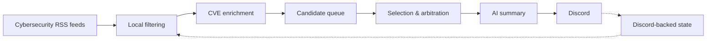
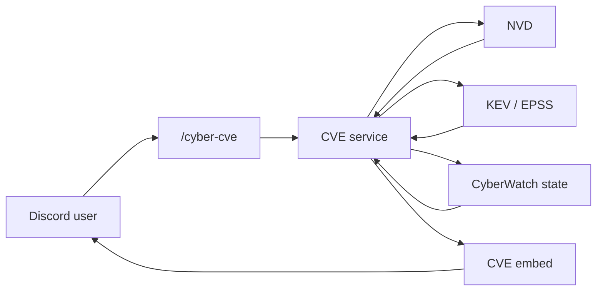
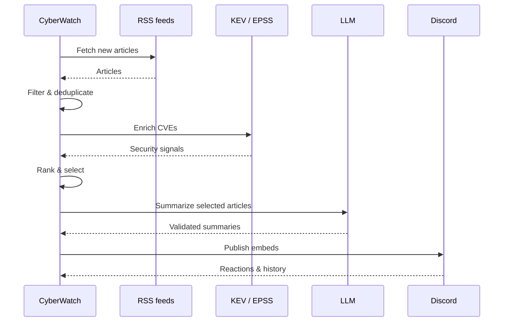
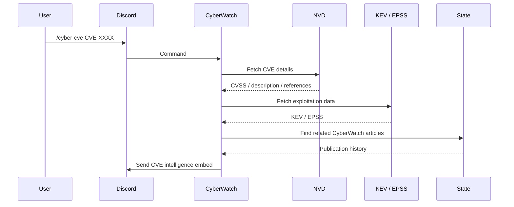

# CyberWatch

**CyberWatch is a self-hosted Discord bot for automated cybersecurity intelligence.**

It continuously monitors cybersecurity RSS feeds, filters and ranks articles locally, enriches vulnerabilities with trusted security data such as **CISA KEV** and **FIRST EPSS**, and publishes a small number of AI-assisted summaries to Discord.

Since **v1.2**, CyberWatch also provides direct **CVE intelligence** through `/cyber-cve`, combining vulnerability information with CyberWatch's own publication history.

The project follows a simple principle:

> **Keep factual security signals deterministic, use AI only where it adds value, and treat untrusted web content as hostile input.**

## Features

* **Local-first filtering** — articles are filtered, scored and deduplicated without an LLM.
* **CVE enrichment** — vulnerabilities are enriched with CISA KEV and FIRST EPSS data.
* **Relative selection** — only the most relevant articles are retained for publication.
* **Urgent alerts** — high-confidence exploitation signals can trigger an immediate alert.
* **AI-assisted summaries** — the LLM is only called after article selection.
* **Security hardening** — untrusted web content is validated before being passed to the LLM.
* **Feedback loop** — Discord reactions adjust lexical ranking signals without modifying factual security data.
* **CVE intelligence** — `/cyber-cve` provides vulnerability information and CyberWatch publication history.
* **No application database** — state is rebuilt from Discord history, keeping the deployment lightweight and disposable.

## Architecture

### Automated watch cycle



Filtering and selection are performed locally. The LLM is only called after the final candidates have been selected.

### CVE intelligence



### Automated watch sequence



### CVE lookup sequence



Detailed design decisions are documented in [`docs/ARCHITECTURE.md`](docs/ARCHITECTURE.md).

## Modules

| File             | Responsibility                                           |
| ---------------- | -------------------------------------------------------- |
| `bot.py`         | Scheduling, slash commands and watch cycle               |
| `sources.py`     | RSS reading and content extraction                       |
| `filters.py`     | Exclusion, scoring and deduplication                     |
| `enrichment.py`  | CISA KEV and EPSS clients                                |
| `selection.py`   | Candidate queue, quotas and arbitration                  |
| `summarizer.py`  | LLM summaries and prompt-injection defenses              |
| `feedback.py`    | Learning weights from Discord reactions                  |
| `publisher.py`   | Discord embed construction                               |
| `state.py`       | Runtime state, deduplication and publication history     |
| `cve_service.py` | CVE lookup and aggregation of vulnerability intelligence |

## Commands

| Command           | Description                              |
| ----------------- | ---------------------------------------- |
| `/cyber-now`      | Start an immediate collection cycle      |
| `/cyber-queue`    | Show candidates currently in the queue   |
| `/cyber-digest`   | Force the daily digest                   |
| `/cyber-feedback` | Display learned feedback weights         |
| `/cyber-status`   | Show bot and feed status                 |
| `/cyber-sources`  | Show RSS feed health                     |
| `/cyber-cve`      | Look up a CVE and its CyberWatch history |

## Installation

### Docker

```bash
git clone https://github.com/Gemukii/CyberWatch.git
cd CyberWatch

cp .env.example .env
nano .env

docker compose up -d --build
docker compose logs -f
```

The container runs as a non-root user with a read-only filesystem and dropped Linux capabilities.

### Without Docker

```bash
python3 -m venv .venv
source .venv/bin/activate

pip install -r requirements.txt

cp .env.example .env
nano .env

python bot.py
```

Required environment variables:

```text
DISCORD_TOKEN
DISCORD_CHANNEL_ID
GEMINI_API_KEY
```

Set `AI_PROVIDER=none` to run without an LLM provider.

Required Discord permissions:

* Send Messages
* Embed Links
* Read Message History
* Add Reactions

## Configuration

Common settings include:

| Variable              | Purpose                                      |
| --------------------- | -------------------------------------------- |
| `DAILY_QUOTA`         | Maximum number of normal articles per digest |
| `DIGEST_MIN_ARTICLES` | Minimum number of articles for a digest      |
| `URGENT_DAILY_MAX`    | Maximum number of urgent alerts              |
| `AI_PROVIDER`         | LLM provider used for summaries              |

Scoring keywords and local ranking signals are defined in `filters.py`.

## Testing

Install development dependencies:

```bash
pip install -r requirements-dev.txt
```

Run the test suite:

```bash
pytest
```

The test suite is fully local and does not require network access or a running Discord bot. Tests cover the project's filtering, selection, enrichment, publishing and security-related behavior.

## Data sources

| Source          | Usage                                                              |
| --------------- | ------------------------------------------------------------------ |
| CISA KEV        | Known exploited vulnerabilities and ransomware-related information |
| FIRST EPSS      | Exploitation probability                                           |
| NVD             | CVE descriptions, CVSS information and references                  |
| RSS feeds       | Cybersecurity news and article content                             |
| Gemini / Ollama | AI-assisted article summaries                                      |

External vulnerability data is used as supporting intelligence. The original source remains authoritative.

## Security

CyberWatch treats retrieved web content as **untrusted input**.

The project therefore keeps factual security signals outside the LLM decision process wherever possible and applies validation before accepting generated summaries.

The feedback system only modifies lexical ranking preferences. It never changes CVE, CVSS, KEV or EPSS data.

See [`docs/ARCHITECTURE.md`](docs/ARCHITECTURE.md) for the complete security design.

## Data and privacy

CyberWatch does not maintain an application database.

Runtime state is kept in memory and reconstructed from the configured Discord channel when necessary. No article archive is maintained by the application.

Publisher content is summarized and linked back to its original source rather than republished.

## Limitations

* RSS feeds can change or become unavailable.
* Purging the Discord channel removes the state used for deduplication and history reconstruction.
* External vulnerability APIs can be temporarily unavailable.
* AI-generated summaries can contain errors; the original article remains authoritative.
* `/cyber-cve` depends on the availability of the configured vulnerability data sources.

## Roadmap

### v1.2 — CVE Intelligence

* [x] CVE data model
* [x] NVD integration
* [x] KEV / EPSS integration
* [x] `/cyber-cve`
* [x] CVE Discord embed
* [x] CyberWatch CVE history
* [x] Documentation and architecture diagrams

### v1.3 — CVE Watchlist

* [ ] Add CVE to watchlist
* [ ] Remove CVE from watchlist
* [ ] List watched CVEs
* [ ] Notify on meaningful CVE changes
* [ ] Notify when a CVE enters CISA KEV

## License

MIT
