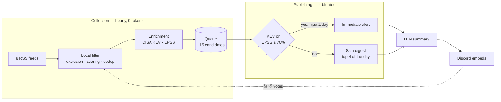
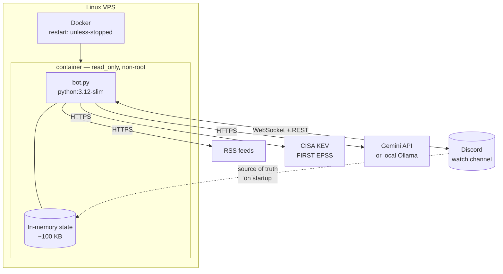

# CyberWatch

<!-- TODO: 2-3 personal lines here — why this project, context -->

- discord bot for cyber watch, 8 RSS feeds
- local filter (0 tokens) → KEV/EPSS enrichment → LLM → discord digest
- 2-4 articles/day, zero cost, no disk writes on the VPS

```
Python 3.10+ · discord.py · Gemini / Ollama · Docker · 111 tests · CI GitHub Actions
```

## Architecture



notes:
- filtering is 100% local, LLM only called after final selection → 2-6 calls/day instead of ~150
- dotted line = feedback loop, votes adjust scoring for later cycles

## Infrastructure



notes:
- discord = the database. anti-duplicate index + feedback weights rebuilt on startup from channel history
- no state file on disk, state survives a reboot

## Modules

| File | Role |
|---|---|
| `bot.py` | Scheduling, slash commands, watch cycle |
| `sources.py` | RSS reading, content extraction |
| `filters.py` | Exclusion, scoring, deduplication |
| `enrichment.py` | CISA KEV and EPSS clients |
| `selection.py` | Candidate queue, quotas, urgent/digest arbitration |
| `summarizer.py` | LLM summary, anti-injection hardening |
| `feedback.py` | Learning weights from reactions |
| `publisher.py` | Embed construction |
| `state.py` | Anti-duplicate index, feed health |

## Decisions

<!-- TODO: reword this, it's the heart of the project -->

- relative selection (top N of the day) instead of a fixed score threshold
  - a fixed threshold is impossible to calibrate: a silent day could mean "nothing important" or "threshold too high", no way to tell which
- web content treated as hostile → indirect prompt injection
  - unicode normalization, random delimiter per request, strict output validation
  - CVEs absent from the source article = rejected (also blocks hallucinations)
  - detected attempt → flagged in the embed, not just silently filtered
- feedback never touches the facts
  - votes adjust the lexical signals (`ransomware`, `phishing`...), never KEV/EPSS/CVE/CVSS
  - a vote = personal preference. KEV = fact verified by CISA

full detail → [docs/ARCHITECTURE.md](docs/ARCHITECTURE.md)

## Installation

### Docker (recommended)

```bash
git clone <repo> /opt/cyberwatch && cd /opt/cyberwatch
cp .env.example .env && nano .env
docker compose up -d --build
docker compose logs -f
```

the bot writes nothing to disk → no volume, disposable container.
multi-stage image, non-root user, `read_only: true`, `cap_drop: ALL`.

### Without Docker

```bash
python3 -m venv .venv && source .venv/bin/activate
pip install -r requirements.txt
cp .env.example .env && nano .env
python bot.py
```

required in `.env`: `DISCORD_TOKEN`, `DISCORD_CHANNEL_ID`, `GEMINI_API_KEY`
(free key at [AI Studio](https://aistudio.google.com/apikey)).
`AI_PROVIDER=none` to test without a key.

discord perms: `Send Messages`, `Embed Links`, `Read Message History`, `Add Reactions`

### systemd (Docker alternative)

```bash
sudo cp cyberwatch.service /etc/systemd/system/
sudo systemctl enable --now cyberwatch
journalctl -u cyberwatch -f
```

### Useful docker commands

```bash
docker compose restart          # restart
docker compose logs -f --tail 50
docker compose up -d --build    # after a code change
docker compose down             # stop
```

## Commands

| Command | Effect |
|---|---|
| `/cyber-now` | Immediate collection cycle |
| `/cyber-queue` | Candidates in the running, with their scores |
| `/cyber-digest` | Force the digest to be sent |
| `/cyber-feedback` | Weights learned from votes |
| `/cyber-status` | Last cycle, KEV status, feeds down |
| `/cyber-sources` | Feed health |

## Settings

- volume → `DAILY_QUOTA` (4 by default)
- `DIGEST_MIN_ARTICLES=2` → quiet day = short watch, not no watch
- `URGENT_DAILY_MAX=2` → cap on alerts outside the quota
- scoring keywords: `filters.py` → `KEYWORD_SIGNALS`
- everything else: `.env.example`

## Tests

```bash
pip install -r requirements-dev.txt
pytest
```

111 tests, no network or Discord. covers scoring, dedup, quota arbitration,
20 prompt-injection cases, feedback guardrails. CI on py 3.10 + 3.12.

## Sources and compliance

| Source | Data used | Terms |
|---|---|---|
| CISA KEV | exploited CVEs, ransomware flag | CC0 / public domain (`cisagov/kev-data` repo) |
| FIRST EPSS | 30-day exploitation probability | free, no signup — **attribution requested** |
| RSS feeds | title, link, excerpt, article text | content copyrighted by the publishers |
| Gemini API | generated summaries | free tier, prompts may be used by Google |

### What the bot does with publisher content

- **never republishes the article** — the summary is reworded, never copied
- **always links back to the original** in every embed, source is credited
- **nothing is archived**: no database, no cache. only the URL stays in memory for dedup
- text retrieval capped at 5 simultaneous connections and a few articles per cycle
- identifiable User-Agent, no paywall bypass, no authentication bypass

posture: personal, non-commercial watch use, no redistribution. commercial
use or republishing would require checking each publisher's terms of
service — that's not the case here.

### Attribution

- EPSS: Jacobs, J. et al. — Exploit Prediction Scoring System, FIRST.org
- KEV: CISA, Known Exploited Vulnerabilities Catalog

### What this project is not

- not a scanning or exploitation tool — it only reads public feeds, nothing else
- no personal data collected
- LLM summaries can contain errors, the original link is authoritative

## Known limitations

- RSS feed URLs change without notice — `/cyber-sources` flags it after 3 silent cycles
- discord channel purged = index lost, articles may be republished once
- an LLM summary is still a summary — the link to the original article is always in the embed