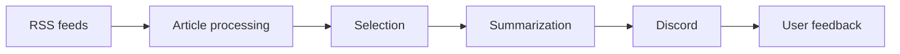

# CyberWatch

CyberWatch is a Python Discord bot that collects, filters, summarizes and publishes cybersecurity news.

The project is designed as a small automated news pipeline and as a portfolio project focused on Python, automation and cybersecurity.

## Features

* RSS feed collection
* Article filtering and categorization
* Content enrichment and CVE information
* Publication selection
* Automatic summaries
* Discord publishing
* Publication state and duplicate prevention
* User feedback
* Automated tests
* Docker deployment
* CI with GitHub Actions

## Architecture



The bot periodically processes articles through this pipeline and publishes only articles that pass the configured rules.

For the detailed architecture and responsibilities of each component, see [`docs/ARCHITECTURE.md`](docs/ARCHITECTURE.md).

## Quick start

### Local

```bash
git clone https://github.com/Gemukii/CyberWatch.git
cd CyberWatch

python -m venv .venv
.venv\Scripts\activate

pip install -r requirements.txt
python bot.py
```

For development and testing dependencies:

```bash
pip install -r requirements-dev.txt
```

### Docker

```bash
docker compose up --build
```

Configuration is provided through environment variables and YAML configuration files.

## Project structure

```text
CyberWatch/
├── bot.py
├── config.py
├── sources.py
├── collector.py
├── filters.py
├── categories.py
├── enrichment.py
├── cve_service.py
├── selection.py
├── summarizer.py
├── publisher.py
├── feedback.py
├── state.py
│
├── feeds.yaml
├── tests/
├── docs/
│   └── ARCHITECTURE.md
│
├── Dockerfile
├── docker-compose.yml
```

## Commands

The bot exposes Discord slash commands for interacting with the running application.

See the source code for the currently available commands.

## Documentation

| Document                               | Purpose                                          |
| -------------------------------------- | ------------------------------------------------ |
| [`Architecture`](docs/ARCHITECTURE.md) | Components, responsibilities and execution flows |

## Tests

Run the test suite with:

```bash
pytest
```

The test suite covers core article processing and publication state behavior.

## Project status

Current development version: **v1.1**

CyberWatch is an evolving portfolio project. Its architecture and filtering pipeline may change as new features are added.
