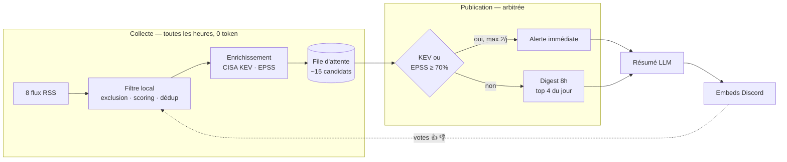
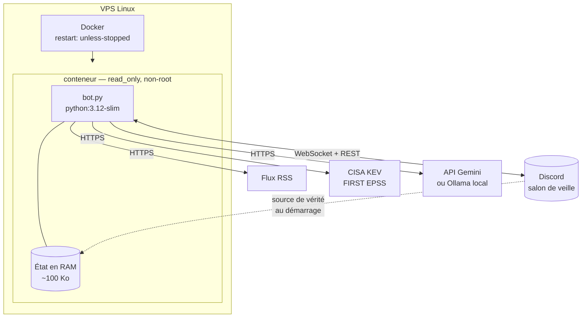

# CyberWatch

<!-- TODO : 2-3 lignes perso ici — pourquoi ce projet, contexte -->

- bot discord de veille cyber, 8 flux RSS
- filtre local (0 token) → enrichissement KEV/EPSS → LLM → digest discord
- 2-4 articles/jour, coût zéro, aucune écriture disque sur le VPS

```
Python 3.10+ · discord.py · Gemini / Ollama · Docker · 111 tests · CI GitHub Actions
```

## Architecture



notes :
- filtre 100% local, LLM appelé qu'après sélection finale → 2-6 appels/jour au lieu de ~150
- pointillé = boucle feedback, votes ajustent le scoring des cycles suivants

## Infrastructure



notes :
- discord = base de données. index anti-doublons + poids feedback reconstruits au démarrage depuis l'historique du salon
- pas de fichier state sur disque, l'état survit à un reboot

## Modules

| Fichier | Rôle |
|---|---|
| `bot.py` | Ordonnancement, commandes slash, cycle de veille |
| `sources.py` | Lecture RSS, extraction du contenu |
| `filters.py` | Exclusion, scoring, déduplication |
| `enrichment.py` | Clients CISA KEV et EPSS |
| `selection.py` | File d'attente, quotas, arbitrage urgence/digest |
| `summarizer.py` | Résumé LLM, durcissement anti-injection |
| `feedback.py` | Apprentissage des poids depuis les réactions |
| `publisher.py` | Construction des embeds |
| `state.py` | Index anti-doublons, santé des flux |

## Décisions

<!-- TODO : à reformuler, c'est le coeur du projet -->

- sélection relative (top N du jour) au lieu d'un seuil de score fixe
  - seuil fixe = impossible à calibrer, un jour de silence peut vouloir dire "rien d'important" ou "seuil trop haut", aucun moyen de savoir lequel
- contenu web traité comme hostile → injection de prompt indirecte
  - normalisation unicode, délimiteur aléatoire par requête, validation stricte de la sortie
  - CVE absentes de l'article source = rejetées (bloque aussi les hallucinations)
  - tentative détectée → signalée dans l'embed, pas juste filtrée en silence
- feedback ne touche jamais aux faits
  - votes ajustent le lexical (`ransomware`, `phishing`...), jamais KEV/EPSS/CVE/CVSS
  - un vote = préférence perso. le KEV = fait vérifié par la CISA

détail complet → [docs/ARCHITECTURE.md](docs/ARCHITECTURE.md)

## Installation

### Docker (recommandé)

```bash
git clone <repo> /opt/cyberwatch && cd /opt/cyberwatch
cp .env.example .env && nano .env
docker compose up -d --build
docker compose logs -f
```

le bot n'écrit rien sur disque → aucun volume, conteneur jetable.
image multi-étages, utilisateur non-root, `read_only: true`, `cap_drop: ALL`.

### Sans Docker

```bash
python3 -m venv .venv && source .venv/bin/activate
pip install -r requirements.txt
cp .env.example .env && nano .env
python bot.py
```

`.env` obligatoire : `DISCORD_TOKEN`, `DISCORD_CHANNEL_ID`, `GEMINI_API_KEY`
(clé gratuite sur [AI Studio](https://aistudio.google.com/apikey)).
`AI_PROVIDER=none` pour tester sans clé.

perms discord : `Send Messages`, `Embed Links`, `Read Message History`, `Add Reactions`

### systemd (alternative à Docker)

```bash
sudo cp cyberwatch.service /etc/systemd/system/
sudo systemctl enable --now cyberwatch
journalctl -u cyberwatch -f
```

### Commandes docker utiles

```bash
docker compose restart          # redémarrer
docker compose logs -f --tail 50
docker compose up -d --build    # après modif du code
docker compose down             # arrêter
```

## Commandes

| Commande | Effet |
|---|---|
| `/cyber-now` | Cycle de collecte immédiat |
| `/cyber-queue` | Candidats en lice, avec leurs scores |
| `/cyber-digest` | Force l'envoi du digest |
| `/cyber-feedback` | Poids appris depuis les votes |
| `/cyber-status` | Dernier cycle, état KEV, flux en panne |
| `/cyber-sources` | Santé des flux |

## Réglages

- volume → `DAILY_QUOTA` (4 par défaut)
- `DIGEST_MIN_ARTICLES=2` → jour calme = veille courte, pas absente
- `URGENT_DAILY_MAX=2` → plafond des alertes hors quota
- mots-clés de scoring : `filters.py` → `KEYWORD_SIGNALS`
- tout le reste : `.env.example`

## Tests

```bash
pip install -r requirements-dev.txt
pytest
```

111 tests, pas de réseau ni de Discord. couvre scoring, dédup, arbitrage des
quotas, 20 cas d'injection de prompt, garde-fous du feedback. CI py 3.10 + 3.12.

## Sources et conformité

| Source | Données utilisées | Conditions |
|---|---|---|
| CISA KEV | CVE exploitées, flag rançongiciel | CC0 / domaine public (dépôt `cisagov/kev-data`) |
| FIRST EPSS | probabilité d'exploitation à 30j | libre, sans inscription — **attribution demandée** |
| Flux RSS | titre, lien, extrait, texte de l'article | contenu sous droit d'auteur des éditeurs |
| API Gemini | résumés générés | free tier, prompts susceptibles d'être utilisés par Google |

### Ce que le bot fait du contenu des éditeurs

- **ne republie jamais l'article** — le résumé est reformulé, jamais copié
- **lien vers l'original systématique** dans chaque embed, la source est nommée
- **rien n'est archivé** : pas de base, pas de cache. seule l'URL reste en mémoire pour la dédup
- récupération du texte limitée à 5 connexions simultanées et quelques articles par cycle
- User-Agent identifiable, pas de contournement de paywall ni d'authentification

posture : usage de veille personnelle, non commercial, sans redistribution.
un usage commercial ou une republication demanderait de vérifier les CGU de
chaque éditeur — ce n'est pas le cas ici.

### Attribution

- EPSS : Jacobs, J. et al. — Exploit Prediction Scoring System, FIRST.org
- KEV : CISA, Known Exploited Vulnerabilities Catalog

### Ce que le projet n'est pas

- pas un outil de scan ni d'exploitation — il lit des flux publics, rien d'autre
- aucune donnée personnelle collectée
- les résumés LLM peuvent contenir des erreurs, le lien original fait foi

## Limites connues

- URL de flux RSS qui changent sans prévenir — `/cyber-sources` signale au bout de 3 cycles muets
- salon discord purgé = index perdu, republication possible une fois
- résumé LLM reste un résumé — lien vers l'article original toujours dans l'embed
