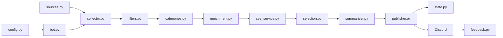
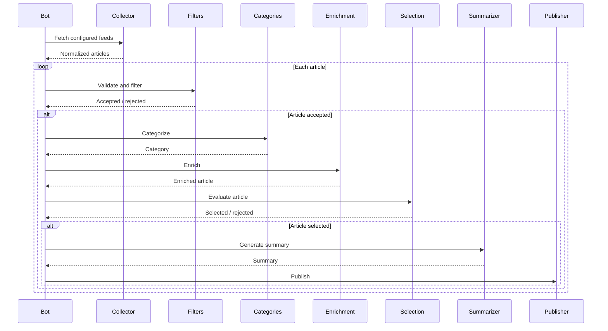
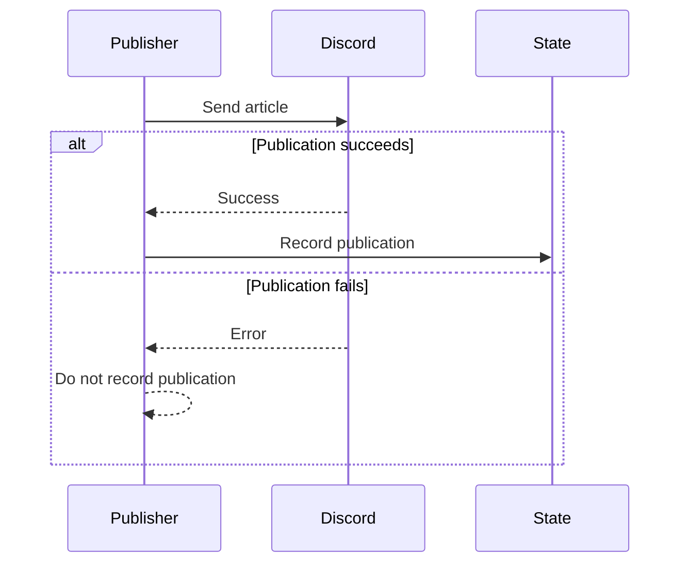
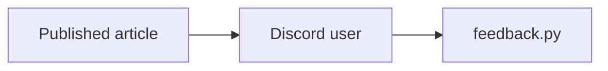

# CyberWatch Architecture

CyberWatch is organized as a processing pipeline. Articles move through several specialized modules before being selected, summarized and published to Discord.

## Overview



## Components

CyberWatch separates the main processing pipeline from supporting services.

### Core pipeline

| Component       | Role                                                  |
| --------------- | ----------------------------------------------------- |
| `bot.py`        | Runs the Discord bot and orchestrates the application |
| `sources.py`    | Loads and manages configured RSS sources              |
| `collector.py`  | Fetches and normalizes articles                       |
| `filters.py`    | Removes irrelevant or invalid articles                |
| `categories.py` | Assigns article categories                            |
| `enrichment.py` | Adds additional information to articles               |
| `selection.py`  | Selects articles for publication                      |
| `summarizer.py` | Generates publication summaries                       |
| `publisher.py`  | Creates and sends Discord messages                    |

### Supporting services

| Component        | Role                                                |
| ---------------- | --------------------------------------------------- |
| `config.py`      | Loads application configuration                     |
| `cve_service.py` | Handles CVE-related information                     |
| `state.py`       | Maintains publication state and prevents duplicates |
| `feedback.py`    | Handles user feedback                               |

## Article processing

The main processing flow is:



## Publication state

Publication state is handled separately from the article processing pipeline.

Its purpose is to prevent an article from being repeatedly published while keeping publication state consistent with the actual Discord result.



This means a failed Discord publication does not permanently mark the article as published.

## Feedback

User feedback is handled after publication.



Feedback is kept separate from the article processing stages so that user interaction does not directly alter the collection pipeline.

## Configuration

Runtime configuration is handled by `config.py`.

RSS sources are maintained separately in:

```text
feeds.yaml
```

This keeps source configuration out of the application logic and allows feeds to be modified without changing the processing modules.

## Tests

Tests are located in:

```text
tests/
├── test_categories.py
├── test_filters.py
└── test_state.py
```

They focus on core processing behavior and state management.

## Deployment

CyberWatch supports containerized deployment through:

```text
Dockerfile
docker-compose.yml
```

The repository also contains a systemd service definition:

```text
cyberwatch.service
```

Automated tests are defined in:

```text
.github/workflows/tests.yml
```

The architecture intentionally keeps each processing step isolated so that individual parts can be tested and modified without having to change the entire pipeline.
